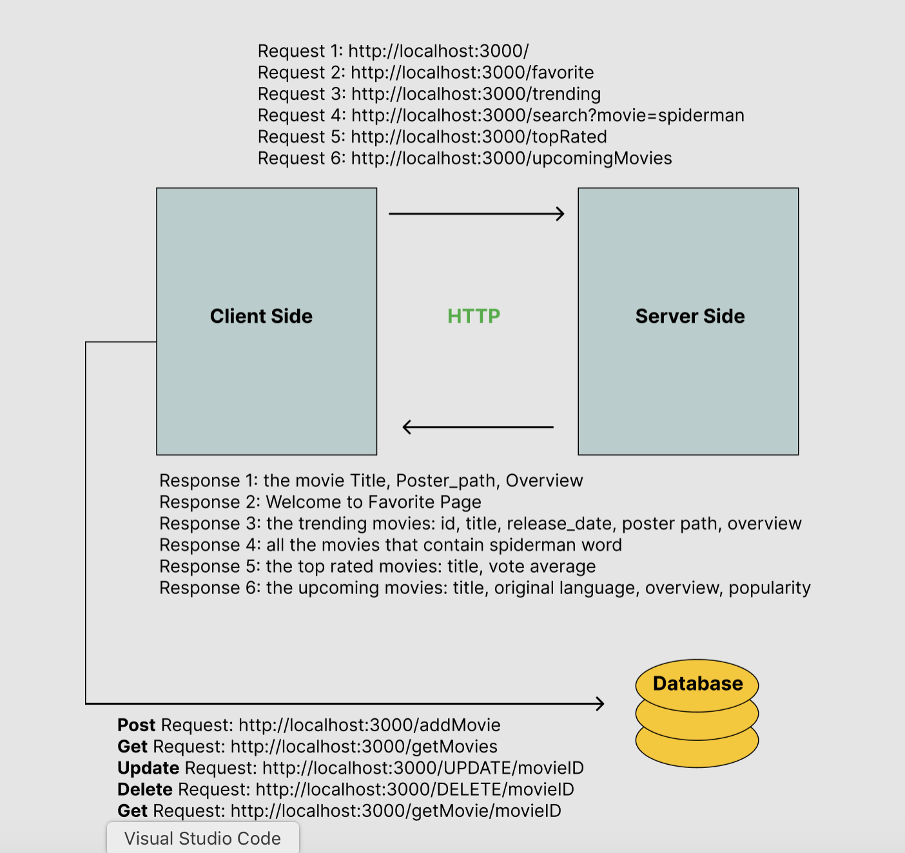

# Movies-Library - v4.0.0

**Author Name**: Lama Radwan

## The Updated WRRC 

## Overview

## Getting Started
1. clone the repo
2. Run "npm init -y" command
3. Run npm install express command
4. Follow the instruction in the task requirements
5. To run the server: node server.js
6. To test the requests install Thunder client extension in the vs code application and start hitting the get requests
7. Setup the psql database
8. Instal  axios, body-parser, cors, dotenv, nodemon, pg

## Project Features
<!-- What are the features included in you app -->
1. A response for the home page it's the default
2. A response for the favorite page
3. A handler for 404 and 500 errors
4. A handler for the trending movies
5. A search api for movies
6. A handler for top rated movies
7. A handler for the upcoming movies
8. PSQL Database handler to add a movie
9. PSQL Database handler to get the added movies
10. Update Database handler to edit any selected movie
11. Delete Database handler to delete any selected movie
12. Get handler based on id to get any selected movie

* What observations or questions do you have about what you’ve learned so far?

The teaching team is doing a great work

* How long did it take you to complete this assignment? And, before you started, how long did you think it would take you to complete this assignment?

I thought it will take 1 hours and it took me 30 minutes